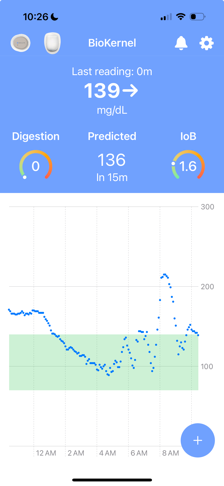

# GlucOS 

<div align="center">
<table border="0" cellspacing="0" cellpadding="0" style="border: 1px solid transparent">
<tr>
<td></td>
<td></td>
<td><br></td>
</tr>
</table>
</div>

## Security, correctness, and simplicity for automated insulin delivery
GlucOS is a new automated insulin delivery system with a focus on
computer security. GlucOS is a simple, yet still fully featured
automated insulin delivery system. Simplicity is important for being
able to understand how the system works and anticipate changes when we
make them.

GlucOS is the first automated insulin delivery system to support
ML-based predictions safely. To read more about how we do it, you can
see our [academic
paper](https://bob.cs.ucdavis.edu/assets/dl/glucos.pdf) on the
topic or checkout this [10 minute youtube video](https://www.youtube.com/watch?v=0SAoigEHjJ4&list=PLS7sMlgd1pNM0KIKUQ-3y0_NRBU6Q-64h&index=3) that introduces the topic. In our paper, we also discuss several novel security mechanisms around
insulin pump driver security, how we model human physiology and use it
as a part of our security system, our use of formal methods to prove correct parts of our implementation, and how
we include humans as a part of the system.

## What's interesting about GlucOS?
At a high level, GlucOS is what an automated insulin delivery system looks like when it's designed by security experts. Beyond the academic contributions, there are a number of other aspects that make GlucOS interesting:
- **It's simple.** It implements state-of-the-art, novel, and safe ML dosing with only a few thousand lines of code.
- **It's adaptive.** Humans are not differential equations, so any practical system needs to be able to detect changes in glucose metabolism and adapt automatically. We adapt every five minutes, hourly, daily, and weekly.
- **It's state-of-the-art.** It includes both novel Deep Neural Network ML that is highly personalized for dosing, as well as more general and novel AI-based dosing algorithms. Both run through our security mechanism for safety, which is the key enabling technology for broad adoption of ML in insulin dosing.
- **It's autonomous.** We minimize data entry and user interactions, automating as much as possible. This automation includes high level meal announcements, fully automated operation, and adjusting the algorithm during exercise in response to people tracking their workouts (with glucose data!) using our watch app.
- **It sees the future.** We have predictive alerts for glycemic imbalance that are simple and effective.
- **It can be adopted by other systems.** Even if you don't want to use our system, the dosing safety logic and glucose predictions can be used by any automated insulin delivery system. My ideal is that other automated insulin delivery systems will work with us to integrate our tech into their systems.

## Warning: This source code is highly experimental

This source code is not meant for people to use yet. Also, the ML
model is highly personalized for one individual and not appropriate
for anyone other than "Bob" from our paper.

Also, we haven't moved the `event-log` server or our formal methods
proofs to this public repo yet.

## Built using LoopKit

GlucOS is a clean-slate design and implementation for automated insulin delivery, but we use [LoopKit](https://github.com/LoopKit) for support. LoopKit is amazing software and handles CGM and pump drivers plus basic abstractions that any automated insulin delivery system would need. By using LoopKit in GlucOS, we can focus on the novel parts of our automated insulin delivery system.

## Getting started

If you'd like to play around with the code and run it in the
simulator, you can build it like this:

```bash
$ git submodule update --init --recursive
$ open ios/MetabolicOS.xcworkspace
```

We also have a version running on TestFlight, contact Professor Sam
King (<a href="mailto:kingst@ucdavis.edu">email</a>) from UC Davis about it if you're interested in getting added.
