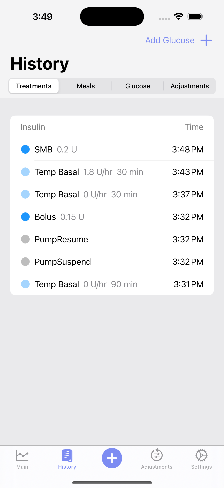

# PumpView

With this feature, we are going to replace the "History" view in the
diagnostic views with a "Pump" view. The current history view pulls
deatils from our closed loop service, but instead we want to pull data
directly from our insulin service and specify the current state and
history for the pump.

In general, we will have a reverse chronological listing of pump
commands. We will support four different high level pump commands:
  - Suspend
  - Resume
  - Basal
  - Bolus

## Architecture

The source of truth for pump commands is the InsulinStorage
service. We will use that to collect data and get notifications when
data updates. Commands that are running can change once they are
complete, and the InsulinStorage service includes a unique
`syncIdentifier` to identify command uniqely and track mutations
consistently.

We will use the `DiagnosticViewModel` to lookup the current values
from the InsulinStorage service and listen for updated and new values.

## Data structures and functions

In the DiagnosticViewModel we'll add:

```swift
struct Suspend {
  let at: Date
}

struct Resume {
  let at: Date
}

struct Bolus {
  let startDate: Date
  let isComplete: Bool
  let programmedUnits: Double
  let isMicroBolus: Bool
  let deliveredUnits: Double?
}

struct Basal {
  let startDate: Date
  let isComplete: Bool
  let isTempBasal: Bool
  let duration: Double
  let rate: Double
  let delieveredUnits: Double?
}

enum PumpDose {
  case suspend(Suspend)
  case resume(Resume)
  case bolus(Bolus)
  case basal(Basal)
}
```

The we need to add an interface to InsulinStorage that allows callers
(DiagnosticViewModel in our case) to atomically get the current pump
commands and register for updates.

```swift
protocol PumpCommandUpdates {
    func update(commands: [DoseEntry])
}

func registerForUpdates(delegate: PumpCommandUpdates) -> [DoseEntry]
```

Within the InsulinStorage service, keep a weak pointer to the
delegate.

For now, don't worry about inferring scheduled basal, we'll figure
that out later.

You'll probably want to keep two data structures. One is a dictionary
keyed on the syncIdentifier for quick lookups for mutating events and
the other is a list of PumpDose that is @Published for the View to
consume.

## Suspend and resume

Suspend and resume are relatively straightforward: they simply show
when the pump is suspended or resumed. We don't need to add much other
than simply displaying these events.

## Basal and bolus

The basal and bolus mechanisms are when we deliver insulin using a
one-time command (bolus) or an ongoing rate of insulin deliver
(basal). For both of these events, they can either be `active` meaning
that they are currently running and thus can change, or they can be
`complete` meaning that they already finished running.

### Basal detail

The pump can run either temporary basal commands, set by the closed
loop algorithm or potentially manually set by the user, or can be
running the scheduled basal rate.

Temp basal commands run for a fix period of time and deliver insulin
using the programmed rate. The closed loop algorith will typically set
30m temp basal commands and then each loop (typically every 5 minutes)
it will set a new temp basal command to adjust insulin delivery. For
already complete temp basal commands we will know how much insulin it
actually delivered and the final duration for the command.

The pump driver does not notify us when scheduled basal rates run, so
we have to infer insulin delivery for these periods of time. We can
infer when the pump is running the scheduled basal rate for any times
when both (1) the pump is _not_ suspended and (2) there is no temp
basal command running.

### Bolus details

Bolus commands are comparatively straightforward compared to
basal. However, we would like to differentiate between boluses entered
by the user manually vs boluses delivered by the algorithm
automatically (micro bolus).

Note: Users can cancel bolus commands while they are in the middle of
running. So when a bolus command transitions from running to complete,
the insulin delivered can change if the command is canceled.

## UI

Here is an example of the Trio "Treatments" page, which is a pretty
good example of what I'm interested in. SMB is Auto bolus in our
system.



For our list we'll use something similar

| Insulin                                 | Time   |
|-----------------------------------------|--------|
| [Blue dot blinking] Bolus 1.5U          | 3:31pm |
| [Purple dot blinking] Temp basal 0.4U/h | 3:30pm |
| [Green dot] Resume                      | 3:30pm |
| [Yellow dot] Suspend                    | 3:25pm |
| [Purple dot] Temp basal 0.2U            | 3:20pm |
| [Blue dot] Basal 0.3U                   | 3:15pm |
| [Teal dot] Auto bolus 0.45U             | 2:55pm |

Where the dots are blinking for any Bolus or Basal events that are
currently running. Note: When the bolus or temp basal commands are
running, use `programmedUnits` and `rate` respectively for the
number. When the commands are complete, use `delieveredUnits` for
both.

### Active Command Display Rules
- Blinking animation: 0.5s on, 0.5s off
- A command is considered "active" when isComplete == false

### Display Formatting
- Insulin units: Show at most 2 decimal places (e.g., "1.5U" or "1.25U")
- Rates: Show as "X.XX U/h" 
- Times: Use relative times for < 1 hour ("5 min ago"), otherwise use localized time.
- Maintain at most 24 hours worth of data